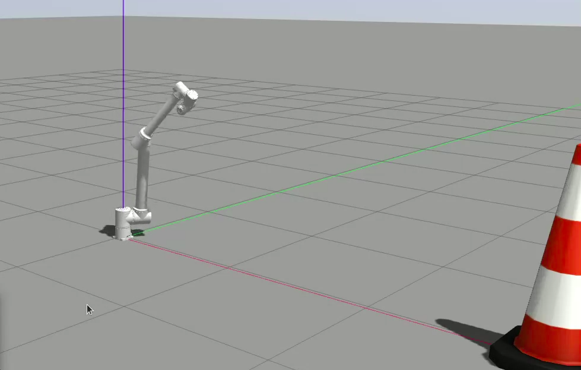

# 🤖 Dynamics Modeling and Control of a 7-DOF Robotic Arm

This project provides the dynamics modeling and control implementation for a 7-degree-of-freedom (7-DOF) robotic manipulator using Python, symbolic computation, and simulation tools.

---

## 📌 Project Overview

The main goals of this project include:

- Modeling the forward and inverse kinematics of a 7-DOF arm
- Deriving the dynamic equations using the Lagrangian method
- Simulating the arm's behavior under different control laws (PD, computed torque, etc.)
- Building a modular structure for future integration with ROS/Gazebo or hardware

---

## 📁 Project Structure

```bash
cobot30_5/
├── config/             # Cấu hình controller, joint limits,...
├── data/               # Dữ liệu mô phỏng, lộ trình, v.v.
├── launch/             # File .launch để chạy node/robot
├── meshes/             # File mesh 3D (dạng .stl, .dae) cho URDF
├── scripts/            # Node Python (.py)
├── urdf/               # Mô hình robot URDF/Xacro
├── worlds/             # Môi trường mô phỏng Gazebo
├── CMakeLists.txt      # Cấu hình build cho catkin
├── package.xml         # Khai báo package ROS
└── requirements.txt    # Thư viện Python cần cài

```
## ⚙️ Dependencies
### Make sure you have Python 3.8+ and the following packages:

## 🚀 Installation and Build Instructions
```bash
#1. Clone the repository into a Catkin workspace
mkdir -p ~/my_ws/src
cd ~/my_ws/src
git clone https://github.com/your_username/your_repo.git
#2. Build the workspace
cd ~/my_ws
catkin_make
#3. Source the setup file
source devel/setup.bash

#📦 Dependencies
sudo apt update
rosdep install --from-paths src --ignore-src -r -y
pip install -r requirements.txt

#▶️ Running the Robot Nodes
roslaunch seven_dof_robot control.launch
```
## 📐 Robot Parameters
```bash
- 7 revolute joints 
- Modified Denavit-Hartenberg convention
```
## 📊 Output
```bash
- Joint angles over time  
- Trajectory tracking plots  
- Torque input over time
- Energy analysis 
``

